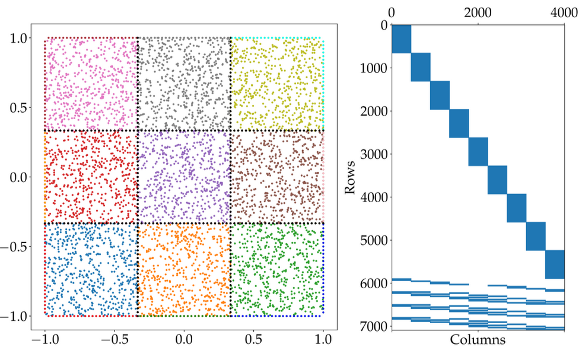
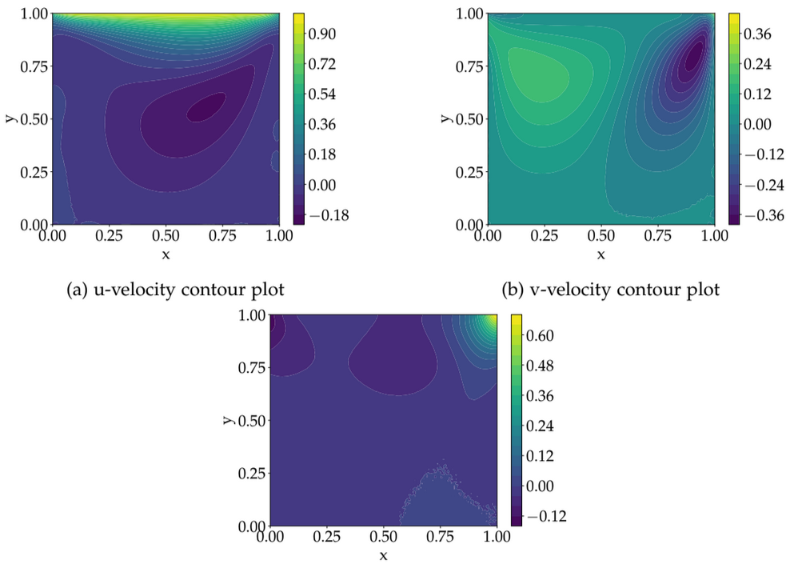
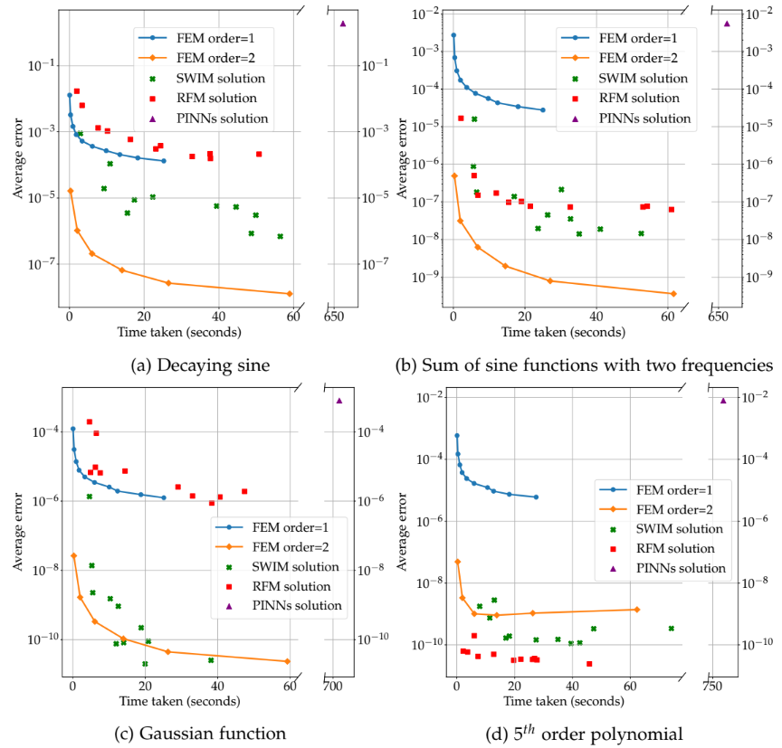
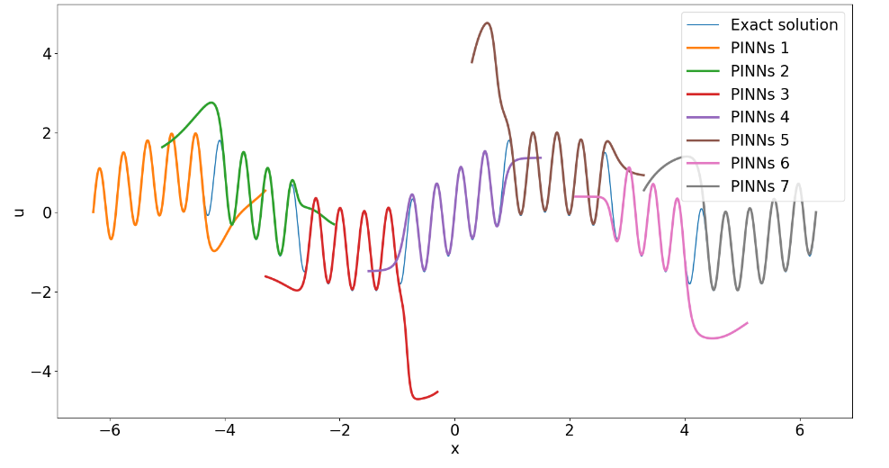
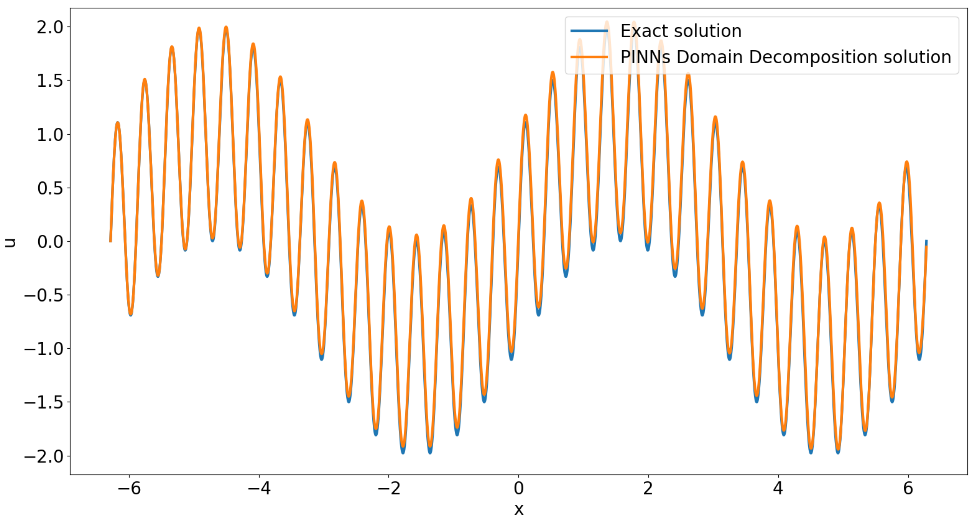
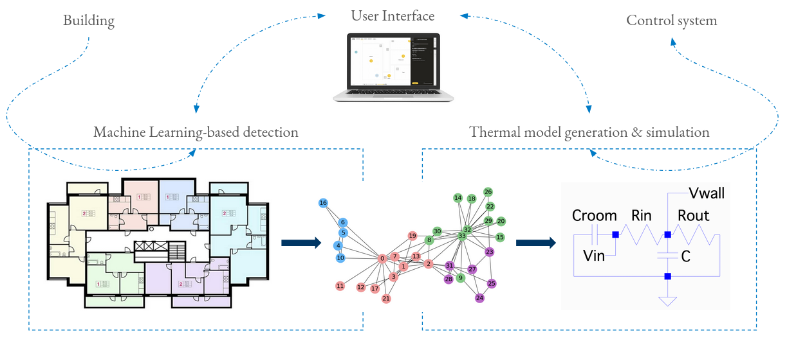

## 1. Using neural networks with domain decomposition to solve partial differential equations (Masters Thesis @TUM)

  - [Masters Thesis Report](https://drive.google.com/file/d/1aRzY0uO0EuEo-sjAcJ55PhoUUyoLp103/view?usp=sharing) and [Masters Thesis Presentation](https://docs.google.com/presentation/d/18DXEvVLHv_ihpI2NOOWP_eQwHBzflc2bxO60JQKBFs0/edit?usp=sharing)
  - Used Extreme Learning Machine (ELM) method to solve partial differential equations.
  - Focused on improving solution accuracy by employing better initialization techniques for neural networks, specifically utilizing the [Sampling Where It Matters](https://arxiv.org/abs/2306.16830) (SWIM) method and domain decomposition.

## 2. Domain decomposition to accelerate learning of Physics Informed Neural Network (PINN) (Seminar course @TUM)

  - [Seminar Paper](https://drive.google.com/file/d/1elvUBqhF1Wdt8j4vHsZ2z32bcLWm-73M/view?usp=sharing)
  - Replicated a paper implementing Finite Basis Physics-Informed Neural Network (FBPINN). link
  - Implemented overlapping subdomains to solve partial differential equations using Physics-Informed Neural Networks.
  - Computed the final solution through additive schwarz domain decomposition.

## 3. Improve Building Efficiency for a Better Future (BGCE @TUM & Siemens)

  - [Github](https://github.com/Adyta99/EnergyPlusPlus)
  - Collaborated with a team to develop an application to enhance building energy efficiency.
  - Created a building’s thermal model and heating control based on user-provided floor plans.
  - Contributed to this project as part of the honors program at BGCE, supervised by Siemens.

## 4. Simulating Free Surface Flows using Marker and Cell method (CFD Lab @TUM)

  - [Github](https://github.com/Adyta99/CFD-Lab)
  - Developed an object-oriented 2D parallel CFD solver in C++ for solving incompressible Navier-Stokes equations using Finite Difference Method (FDM).
  - Extended the solver to support free surface flows utilizing the Marker and Cell Method, successfully simulating dam break and tank sloshing scenarios.

## 5. Using Entropically Damped Artificial Compressibility to simulate Rayleigh-Benard Convection (Undergraduate Thesis @BITS)
  - [Undergraduate Thesis Report](https://drive.google.com/file/d/1KlfDYjxakmnmxWMtsdNPuePczoYdpFKv/view?usp=sharing)
  - Utilized the EDAC technique to obtain solutions for the Navier-Stokes equation, bypassing the pressure
  - Poisson equation by implementing a pressure-evolving equation.
  - Extended the existing Fortran codebase for the Rayleigh-Bénard Convection Problem, adding new functionalities and improving performance.
